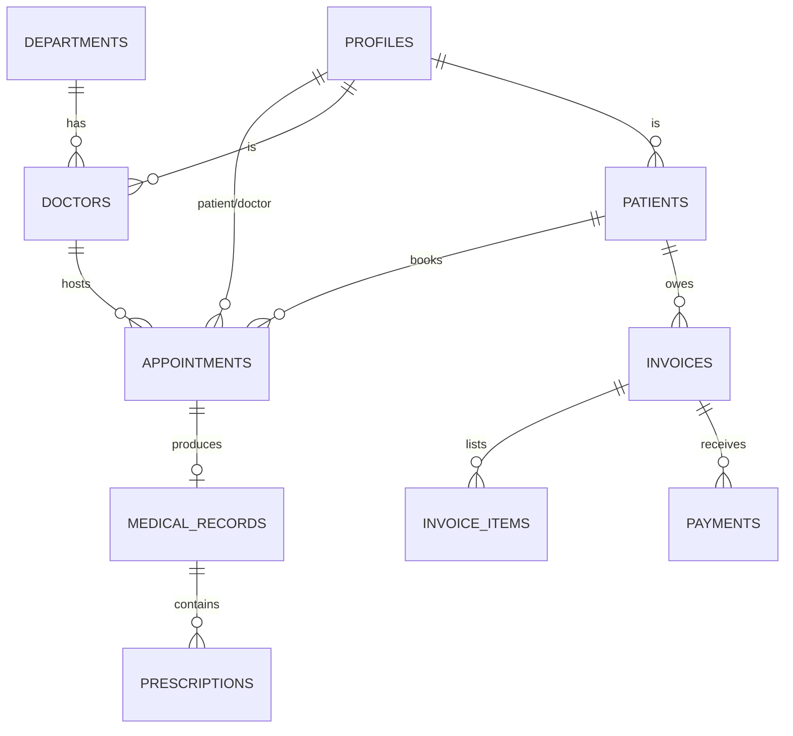

# Life Blossom — Architecture

> **Plain-language summary:** This document explains *how* the app is built. It covers the
> technology choices, how the pieces fit together, the database design (the heart of the app),
> security, the PWA strategy, and how the system can grow from 1 clinic to many without a rewrite.

---

## 1. Technology Stack

| Layer | Choice | Why |
|---|---|---|
| Framework | **Next.js (App Router) + TypeScript** | Server components = fast pages + security by default; industry standard; type safety catches bugs before users do |
| Styling | **Tailwind CSS** | Utility classes → fast, consistent, responsive design |
| Backend / Database | **Supabase** (Postgres, Auth, Storage, RLS) | Postgres database + built-in auth + row-level security in one service; generous free tier; production-grade |
| Data access | **Supabase JS client** + PostgREST | Direct, typed queries from Next.js server components; RLS enforced on every query |
| PWA | **`@serwist/next`** (Workbox-based) or `next-pwa` | Service worker for offline shell + app installability |
| Deployment | **Netlify** (or Vercel) | Free tier with CDN + HTTPS; easy deploys from Git |
| Forms/validation | **Zod** + react-hook-form (or plain Server Actions with Zod) | Validate data on the server — never trust the browser |
| Dates/times | **date-fns** | Small, predictable date handling |
| Charts (later) | **Recharts** | Dashboard charts for admin |
| Testing | **Vitest** (unit) + **Playwright** (E2E, later) | Fast unit tests now; browser tests before launch |
| Lint/format | **ESLint + Prettier** (shipped with Next.js) | Consistent code |

> **Rule:** only add a new dependency when it clearly earns its place. Every dependency is
> code you must maintain and a possible security risk. Check with the user before adding.

---

## 2. High-Level Architecture

```
┌────────────────────────────  Clients ────────────────────────────┐
│  Browser (desktop)        Phone browser / installed PWA          │
└────────────────────────────────┬─────────────────────────────────┘
                                 │ HTTPS (CDN)
┌────────────────────────────────▼─────────────────────────────────┐
│                        NETLIFY (hosting)                         │
│  Next.js App Router (React Server Components + Server Actions)   │
│  • Pages: /login /dashboard /appointments /patients /doctors     │
│  • PWA: manifest.json + service worker (offline shell)           │
│  • Static assets cached on CDN                                   │
└───────────────┬────────────────────────────────┬─────────────────┘
                │ Supabase JS client              │ Server-side client
                │ (browser: user's own tokens)     │ (service-role only in
                ▼                                  ▼  server-only code)
┌──────────────────────────────────────────────────────────────────┐
│                      SUPABASE (managed Postgres)                 │
│  • Postgres database (tables below) + RLS policies               │
│  • Auth: email/password, sessions, JWT with role claims          │
│  • Storage: (later) uploads — scans, documents                   │
│  • Backups: automatic (free tier: daily)                         │
└──────────────────────────────────────────────────────────────────┘
```

**Data flow rules:**
- **Server Components fetch data** directly from Supabase using the **anon key + the user's JWT**.
  RLS decides what that user may see. This is the default path — fast and secure.
- **Mutations** go through **Server Actions** (server-validated with Zod) or RPC functions.
- The **service_role key lives only in server-side code** (env var, never shipped to the browser)
  and is reserved for admin-only operations that RLS cannot express. Prefer RLS; use service role rarely.
- **Client components** only hold UI state; they never trust the database directly without RLS backing them.

---

## 3. Project Structure

```
life-blossom/
├── .env.local                  # local secrets (git-ignored)
├── supabase/
│   ├── migrations/             # SQL migrations (source of truth for schema)
│   └── seed.sql                # demo data for local dev
├── src/
│   ├── app/                    # Next.js App Router pages
│   │   ├── (auth)/login/
│   │   ├── (dashboard)/
│   │   │   ├── page.tsx                    # role-aware dashboard
│   │   │   ├── appointments/
│   │   │   ├── patients/
│   │   │   ├── doctors/
│   │   │   ├── departments/
│   │   │   ├── billing/
│   │   │   └── profile/
│   │   └── layout.tsx
│   ├── components/             # small reusable UI (Button, Card, Badge, ...)
│   ├── lib/
│   │   ├── supabase/           # server + browser clients
│   │   ├── auth/               # role guards, helpers
│   │   ├── validations/        # Zod schemas (shared server/client)
│   │   └── utils.ts
│   ├── types/                  # shared TS types for tables
│   └── middleware.ts           # route protection by role
├── public/
│   ├── manifest.webmanifest    # PWA manifest
│   └── icons/                  # PWA icons
├── tests/                      # Vitest unit tests
├── e2e/                        # Playwright tests (later phase)
└── docs/                       # this documentation set
```

---

## 4. Data Model

> **Naming rules:** `snake_case` table & column names, `uuid` primary keys, `timestamptz`
> timestamps, foreign keys named `<thing>_id`. Every table gets `created_at`, most get `updated_at`.



### 4.1 `profiles`
One row per user, linked 1:1 to Supabase Auth users.

| Column | Type | Notes |
|---|---|---|
| `id` | uuid PK | = `auth.users.id` (FK on insert) |
| `full_name` | text | |
| `role` | text | `admin` \| `doctor` \| `receptionist` \| `billing` \| `patient` |
| `phone` | text | |
| `created_at` | timestamptz | |

### 4.2 `departments`
| Column | Type | Notes |
|---|---|---|
| `id` | uuid PK | |
| `name` | text unique | e.g. "Cardiology" |
| `description` | text | |

### 4.3 `doctors`
| Column | Type | Notes |
|---|---|---|
| `id` | uuid PK | = `profiles.id` |
| `department_id` | uuid FK → departments | |
| `specialty` | text | e.g. "Interventional cardiology" |
| `license_number` | text | |
| `is_active` | boolean | soft-disable instead of delete |

### 4.4 `patients`
| Column | Type | Notes |
|---|---|---|
| `id` | uuid PK | |
| `user_id` | uuid FK → profiles (nullable) | set when patient creates an account |
| `first_name` / `last_name` | text | |
| `date_of_birth` | date | |
| `gender` | text | `male` \| `female` \| `other` |
| `blood_group` | text | A+, A-, B+, B-, AB+, AB-, O+, O- |
| `phone` | text | unique-ish, used for search |
| `email` | text | |
| `address` | text | |
| `emergency_contact_name` / `_phone` | text | |
| `notes` | text | allergies etc. |

### 4.5 `appointments`  ← the heart of the app
| Column | Type | Notes |
|---|---|---|
| `id` | uuid PK | |
| `patient_id` | uuid FK → patients | |
| `doctor_id` | uuid FK → doctors | |
| `department_id` | uuid FK → departments | denormalized for list views |
| `scheduled_at` | timestamptz | |
| `status` | text | `scheduled` → `checked_in` → `in_progress` → `completed`; also `cancelled`, `no_show` |
| `reason` | text | patient's stated reason |
| `notes` | text | internal staff notes |
| `created_by` | uuid FK → profiles | receptionist or patient |

**Double-booking guard:** a `UNIQUE` constraint on `(doctor_id, scheduled_at)` + friendly
validation before insert. A patient can also be blocked from booking two slots at once
(check in code or a trigger).

### 4.6 `medical_records` (one per visit/encounter)
| Column | Type | Notes |
|---|---|---|
| `id` | uuid PK | |
| `appointment_id` | uuid FK → appointments (nullable) | |
| `patient_id` | uuid FK → patients | |
| `doctor_id` | uuid FK → doctors | |
| `symptoms` | text | |
| `diagnosis` | text | |
| `notes` | text | |
| `created_at` | timestamptz | immutable once saved |

### 4.7 `prescriptions`
| Column | Type | Notes |
|---|---|---|
| `id` | uuid PK | |
| `medical_record_id` | uuid FK → medical_records | |
| `patient_id` | uuid FK → patients | denormalized |
| `medication` | text | |
| `dosage` | text | e.g. "500mg" |
| `frequency` | text | e.g. "twice daily" |
| `duration` | text | e.g. "7 days" |
| `instructions` | text | e.g. "Take after food" |
| `created_at` | timestamptz | |

### 4.8 `invoices` + `invoice_items` + `payments`
`invoices` — `id`, `invoice_number` (unique, generated), `patient_id`, `appointment_id` (nullable),
`status` (`draft` \| `issued` \| `paid` \| `cancelled`), `subtotal`, `tax`, `total` (numeric), `issued_at`, `due_at`.

`invoice_items` — `id`, `invoice_id` FK, `description`, `quantity` numeric, `unit_price` numeric, `amount` (computed).

`payments` — `id`, `invoice_id` FK, `amount`, `method` (`cash` \| `card` \| `mobile` \| `insurance`),
`received_by` FK → profiles, `paid_at`. A single invoice can have multiple partial payments.

**Money rule:** use Postgres `numeric`, never floating point. Compute `amount = quantity * unit_price` at write time and store it.

### 4.9 (Later) `lab_orders`, `admissions`/`beds`, `audit_logs`, `notifications`

---

## 5. Authentication & Authorization

- **Auth:** Supabase Auth with email + password (and email confirmation). Users are created by
  an admin/receptionist *or* self-signup as `patient`.
- **Identity link:** after signup, a trigger creates the matching row in `profiles` and, for
  patients, in `patients`. **Never trust the client to claim a role.**
- **Role claims:** the role is read from the `profiles` table with each query (RLS checks it),
  or embedded into the JWT via a custom claim for performance. Simpler first: read from DB.
- **Route protection:** `middleware.ts` redirects logged-out users to `/login` and blocks
  routes by role (e.g. `/billing` needs `admin` or `billing`).

### Row Level Security (RLS) — the security backbone
RLS is **the** security model. Policies are written in SQL and enforced by Postgres on
*every* query — even if a client misbehaves. Summary of policies:

| Table | Patient (own rows) | Doctor | Receptionist | Billing | Admin |
|---|---|---|---|---|---|
| profiles | read own | read own + patients | read all | read all | read all |
| patients | read/write own (via user_id) | read all | read/write all | read all | read/write all |
| appointments | read/write own | read/write all | read/write all | read | read/write all |
| medical_records | read own | read/write own patients | read | — | read all |
| prescriptions | read own | read/write own | read | — | read all |
| invoices | read own | — | — | read/write all | read/write all |

> **Golden rule:** RLS is *enabled* on every table from the first migration. No table ships
> without policies. A bug in the UI is fixed with a PR; a missing RLS policy is a data breach.

---

## 6. Key Design Decisions

1. **Server Components over client fetches.** Pages fetch data on the server (fast, typed,
   RLS-protected). Client components only for interactivity (forms, modals, live search).
2. **Server Actions for writes**, each validating input with a Zod schema before touching the DB.
3. **Migrations are the source of truth.** `supabase/migrations/` contains every schema change,
   ordered and immutable once applied. Never hand-edit the remote DB.
4. **Soft deletes** for doctors/departments (`is_active`) — historical records must not break.
5. **Time zones:** store `timestamptz`, display in the clinic's local time zone.
6. **IDs:** `uuid` (v4) everywhere — safe to expose in URLs, no enumeration attacks.
7. **One canonical way to do things** — the codebase is beginner-friendly, so repeated patterns
   (query helper, form pattern, error banner) are extracted into `lib/` and reused.

---

## 7. PWA Strategy

- `public/manifest.webmanifest` + icons → installable ("Add to Home Screen").
- **Service worker** (via `@serwist/next`): precache the app shell (HTML, JS, CSS, icons) so
  the app **opens offline**; network-first for data, cache-first for static assets.
- **Offline behavior (MVP):** the shell loads with a "You're offline" banner; reads that were
  already fetched stay visible; writes are blocked with a friendly message. Full offline
  write-queueing is a later phase (complex — don't build it first).
- **iOS notes:** PWA works on iPhone, but some features (badges, background sync) are limited — acceptable.

---

## 8. Environment Variables

| Variable | Where | Secret? |
|---|---|---|
| `NEXT_PUBLIC_SUPABASE_URL` | browser + server | No |
| `NEXT_PUBLIC_SUPABASE_ANON_KEY` | browser + server | No (it's public by design — RLS protects data) |
| `SUPABASE_SERVICE_ROLE_KEY` | **server only** | **Yes — never in client code or `NEXT_PUBLIC_`** |

`.env.local` is git-ignored. A `.env.example` is committed with placeholder values.
Local Supabase (`supabase start`) generates its own keys.

---

## 9. Testing & Quality

| Level | Tool | Scope |
|---|---|---|
| Unit | Vitest | utils, Zod schemas, price math, status transitions |
| Component | Vitest + React Testing Library | key components (appointment form, invoice table) |
| E2E (later) | Playwright | login → book → check-in → visit → bill (the golden path) |
| Typecheck | `tsc --noEmit` | entire codebase, always green |
| Lint | ESLint | always green |

**CI (later phase):** GitHub Actions running typecheck + lint + tests + a build on every PR.

---

## 10. Scaling Path (from 1 clinic to many, without a rewrite)

**Phase 0 — Launch (free, this plan):**
- Single Supabase instance + Netlify CDN. Postgres handles thousands of rows easily.
- Add indexes on: `appointments(doctor_id, scheduled_at)`, `appointments(patient_id)`,
  `patients(last_name)`, `patients(phone)`, `invoices(status)`.

**Phase 1 — Growing clinic (Supabase Pro ≈ $25/mo):**
- Larger database, daily backups retained longer, no auto-pause.
- Add **PgBouncer** (connection pooling) when connection count grows.
- Add **Redis cache** (Upstash free tier) for hot reads: doctor schedules, dashboard counts.
- Add **email notifications** via a free tier (Resend) for booking confirmations.

**Phase 2 — Multi-clinic / multi-tenant (still no rewrite):**
- Add `clinic_id` to key tables, extend every RLS policy with a clinic check,
  and a `clinics` table. Schema stays relational — this is an additive change.

**Phase 3 — Heavy scale:**
- Move to **Supabase read replicas** for reporting queries.
- Put the **dashboard behind a materialized view** refreshed periodically instead of live queries.
- Move heavy jobs to **Edge Functions / queue** (e.g., invoice PDF generation).
- CDN + ISR already handles static content; keep dynamic pages lean.

**Signals that trigger each phase:**
- Pro: free tier paused after 7 days inactivity, or storage/DB > 80% of free limits.
- Multi-tenant: second clinic asks to join.
- Replicas: dashboards feel slow (> 2s) during peak hours.

---

## 11. Failure & Recovery Plan

| Failure | Impact | Mitigation |
|---|---|---|
| Supabase free project pauses (7 days idle) | App down until unpause | Log in to dashboard regularly during dev; move to Pro before real launch |
| DB restored from backup | Lose < 1 day of data | Supabase daily backups; re-verify RLS after restore |
| Netlify deploy fails | Old version keeps serving | Deploys are atomic; roll back to previous deploy in one click |
| Service worker caches stale data | Users see old UI | Versioned cache names; network-first for data |
| Service-role key leaks | Full data access | Rotate immediately in Supabase dashboard; audit logs; key is server-only |

---

*Last updated: 2026-09-04 — Schema and stack decided; no code yet. Companion docs:
`Architecture-essential.md` (build-first version), `Prd.md`, `stages-of-completion.md`.*